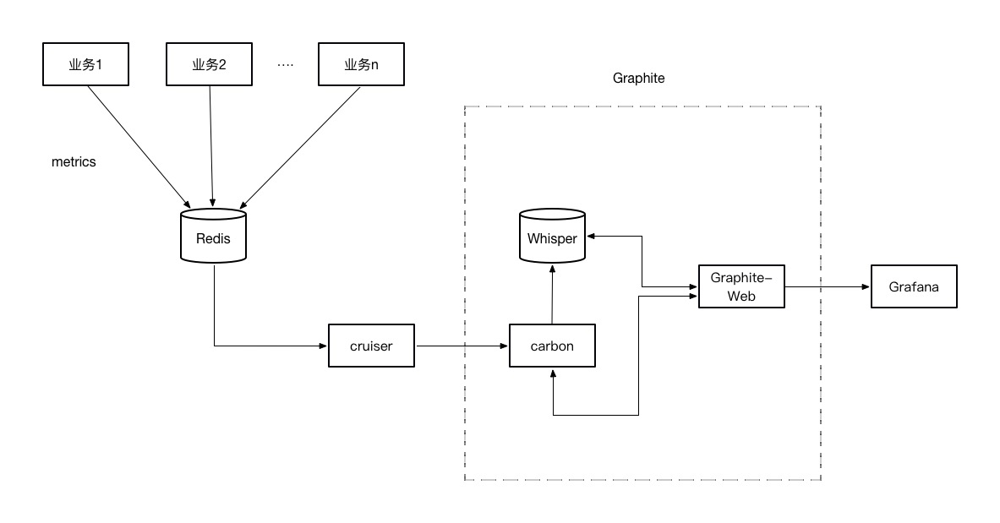
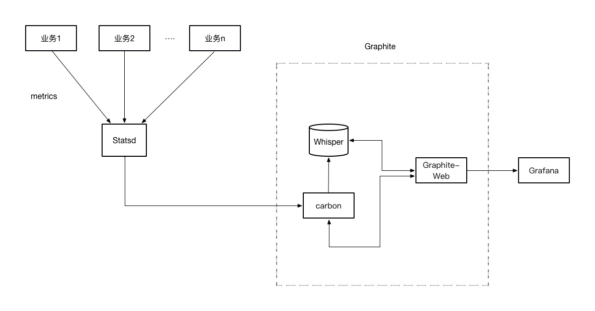

#### 现有系统设计图

当前系统面临的问题：

1. 业务方添加指标，需要更改cruiser配置读取新指标，人工操作略显麻烦
2. 依赖组件Redis，若Redis出现宕机，非业务性功能会影响业务功能

针对上述问题，提出两种解决方案。

#### 方案一

规范监控指标写入特定Redis的某个db或以指定前缀开头，cruiser通过scan命令迭代指标集。

此方案解决了当前系统面临的问题1。

改造影响范围:

- 各业务方需要更改监控上报逻辑，根据新规范写入指标
- cruiser改造

#### 方案二

系统设计图:

说明：

- 业务方通过Statsd客户端上报数据，如：[python](https://github.com/jsocol/pystatsd)、[java](https://github.com/tim-group/java-statsd-client)
- Statsd通过UDP接收数据，这样即使Statsd服务出现问题，也不会对各业务方造成影响

此方案解决了当前系统面临的问题1、2。

改造影响范围：

- 替换各业务方原有的指标上传方式，通过语言提供的Statsd客户端上报指标（需要确认当前异构系统所用的语言是否有对应的客户端）

  

