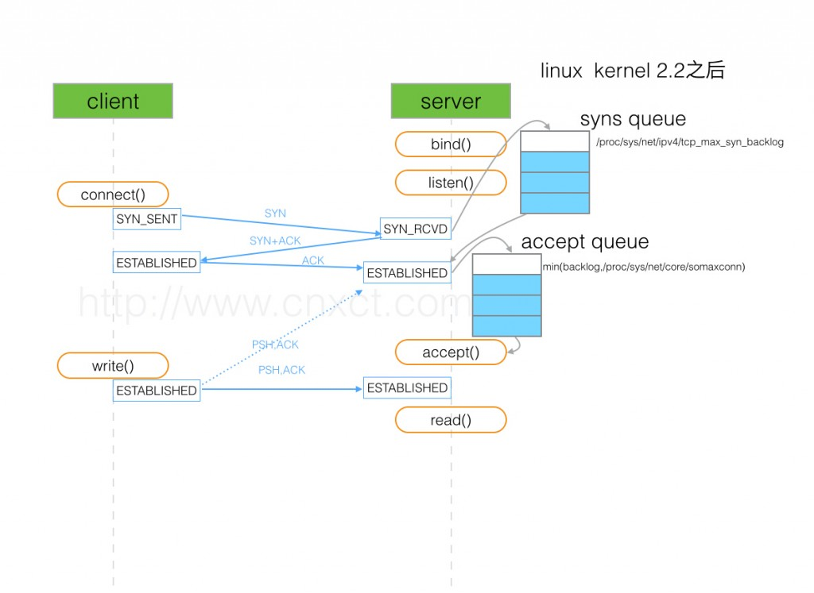
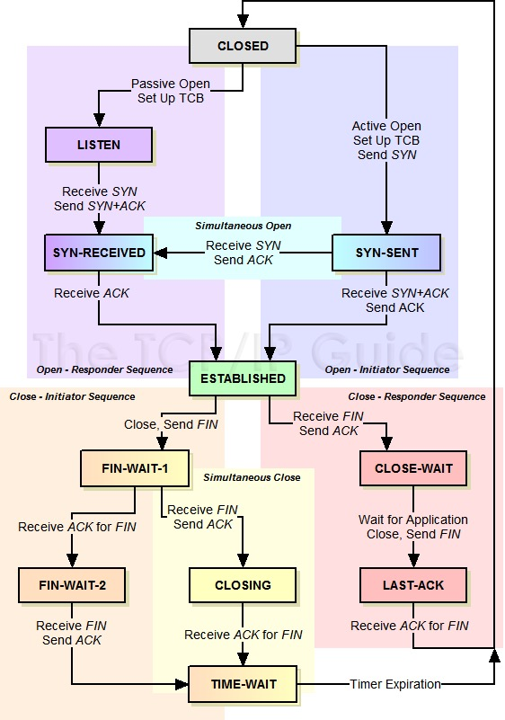

#### 三次握手过程



#### 状态图



#### 问题排查工具

netstat -s:查看网卡统计信息

ss	[ OPTIONS ]	[ STATE-FILTER ] [ ADDRESS-FILTER ]

```shell
ADDRESS-FILTER:

dst 10.0.0.0/24:22

dport gt :443

比较符号支持: lt、gt、eq等
过滤器间可以通过or、and逻辑连接符，not取反

```

ss命令详细文档说明: [SS Utility: Quick Intro](https://www.cyberciti.biz/files/ss.html)

